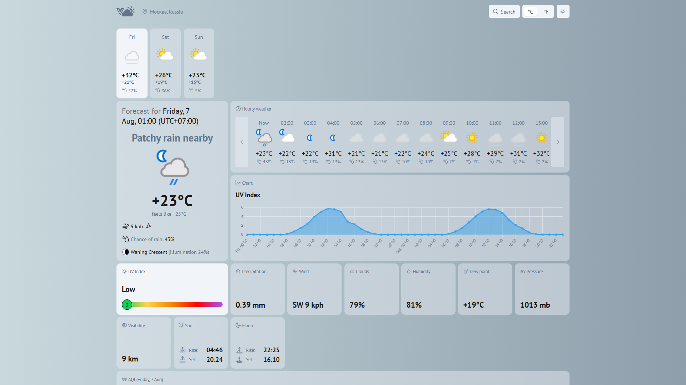
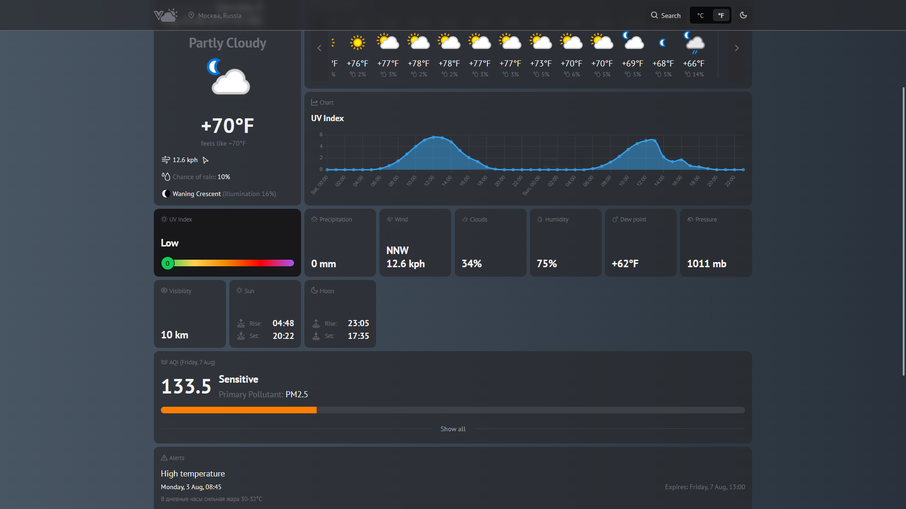
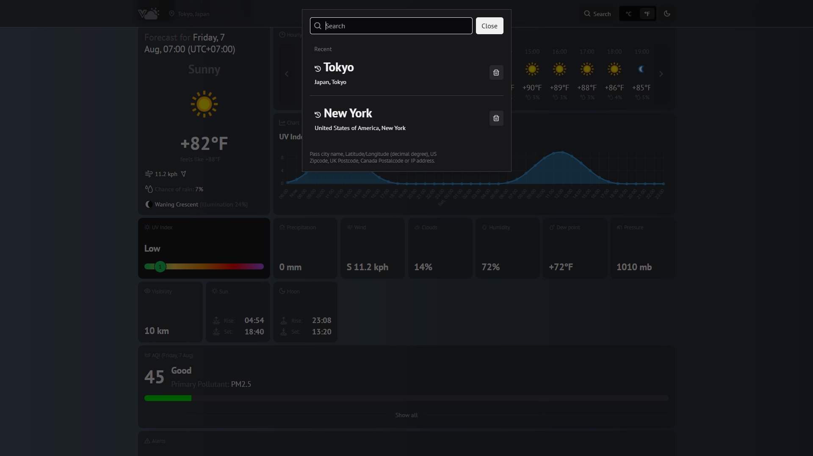
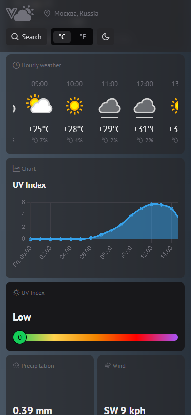

# 🌧️ VueWeather

Прогноз погоды на Vue 3 и TypeScript: трёхдневный и почасовой прогноз, интерактивные графики по восьми метрикам, качество воздуха, астрономические данные и предупреждения о погодных явлениях.


🔗 **[Живое демо](https://vue-weather-plum.vercel.app/)**

## Демонстрация



<details>
<summary>Больше скриншотов</summary>

|                                                  |                                       |
| ------------------------------------------------ | ------------------------------------- |
| Тёмная тема                                      | Поиск                                 |
|         |  |
| Мобильная версия                                 |                                       |
|  |                                       |

</details>

## О проекте

Небольшое приложение, доведённое до состояния, в котором его не стыдно показать: строгая типизация ответов внешнего API, состояние без лишних библиотек, графики, синхронизированные с выбранным днём, и вёрстка, которая одинаково работает на телефоне и на широком мониторе.

## Возможности

- Поиск локации по названию с подсказками
- Текущая погода: температура, ощущается как, ветер, давление, влажность, видимость
- Прогноз на 3 дня с переключением между днями
- Почасовой прогноз — от текущего часа, с продолжением на следующие сутки
- **Интерактивные графики** по метрикам: температура, УФ-индекс, ветер, влажность, осадки, облачность, давление, точка росы
- Качество воздуха (AQI) с расшифровкой уровней
- Астрономия: восход и закат солнца и луны, фазы луны собственными SVG-иконками
- Погодные предупреждения от метеослужб
- Переключение °C / °F
- Светлая и тёмная темы
- Адаптивная сетка от телефона до широкого экрана

## Стек

| Слой      | Технологии                                     |
| --------- | ---------------------------------------------- |
| Фреймворк | Vue 3 Composition API (`<script setup>`)       |
| Язык      | TypeScript                                     |
| Сборка    | Vite                                           |
| UI        | PrimeVue + PrimeIcons, тема `@primeuix/themes` |
| Графики   | Chart.js                                       |
| Даты      | moment                                         |
| Данные    | [WeatherAPI](https://www.weatherapi.com/)      |
| Деплой    | Vercel + Speed Insights                        |

## Технические решения

### Состояние на `reactive` вместо Pinia

Приложение работает с одним доменом данных — погодой в выбранной точке. Полноценный стор здесь был бы лишним слоем, поэтому состояние — это один `reactive`-объект (`store/store.ts`), который держит данные, флаги загрузки, ошибку, выбранный день и активный график, и сам умеет их менять.

Внутри есть небольшая, но полезная деталь: кэширование предыдущего запроса (`prevQuery`, `prevDayIndex`). Переключение между днями уже загруженного прогноза не дёргает API повторно — данные на все три дня приходят одним ответом.

### Полная типизация ответа API

`utils/weatherInterface.ts` описывает структуру ответа WeatherAPI целиком — от текущей погоды до почасовых записей и предупреждений. Это не формальность: ответ у WeatherAPI глубоко вложенный, и без типов обращение к `data.forecast.forecastday[0].hour[12].condition.icon` превращается в угадывание. Отдельный файл `weatherInititalStates.ts` задаёт начальные состояния той же формы, поэтому компоненты никогда не встречают `undefined` на первом рендере.

### Синхронизация состояния с URL

Локация и выбранный день живут в query-параметрах (`?lat=...&lon=...&day=1`). Компонент следит за `route.query` через `watch` и перезагружает данные при изменении. Практический результат — ссылкой на конкретный город и день можно поделиться, и кнопка «назад» в браузере работает так, как пользователь ожидает.

### Вычисления вынесены в утилиты

```bash
utils/
  ├── getFormattedTemp.ts       # °C ↔ °F
  ├── getFormattedTime.ts       # форматирование времени
  ├── getFormattedAqi.ts        # индекс качества воздуха → текст и цвет
  ├── getHourlyWeatherFor.ts    # почасовой прогноз со сдвигом через границу суток
  └── getMoonPhaseIcon.ts       # фаза луны → компонент иконки
```

Самая неочевидная из них — `getHourlyWeatherFor`: почасовой прогноз должен начинаться с текущего часа и продолжаться в следующие сутки, поэтому часы из нескольких дней склеиваются через `flatMap` и обрезаются от нужной точки.

## Структура

```bash
src/
  ├── api/weatherApi.ts       # запросы к WeatherAPI
  ├── store/store.ts          # реактивное состояние
  ├── utils/                  # типы и форматирование
  ├── components/
  │  ├── WeatherCurrent.vue   # текущая погода
  │  ├── WeatherHourly.vue    # почасовой прогноз
  │  ├── ForecastDays.vue     # выбор дня
  │  ├── WeatherChart.vue     # графики Chart.js
  │  ├── AirQuality.vue       # AQI
  │  ├── AstroInfo.vue        # солнце, луна, фазы
  │  ├── AlertsItems.vue      # предупреждения
  │  ├── SearchLocation.vue   # поиск с подсказками
  │  └── icons/               # SVG-иконки, включая 8 фаз луны
  └── router.ts
```

## Запуск

```bash
npm install
cp .env.example .env   # вписать свой ключ WeatherAPI
npm run dev
```

Бесплатный ключ — на [weatherapi.com](https://www.weatherapi.com/).

## Что можно улучшить

- **Ключ API попадает в клиентский бандл** (`VITE_` переменные всегда публичны). Правильное решение — прокси-функция на стороне сервера; сейчас частично закрыто ограничением ключа по домену.
- Определение геолокации через браузер не реализовано: по умолчанию открывается Москва, дальше — поиск или параметры `lat`/`lon` в URL.
- Нет тестов; форматирующие утилиты покрываются юнит-тестами почти без усилий.
